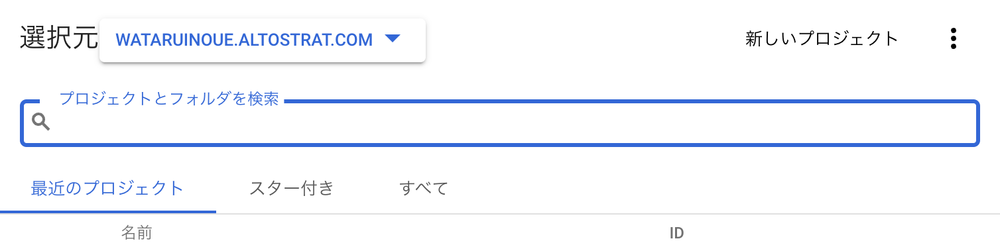
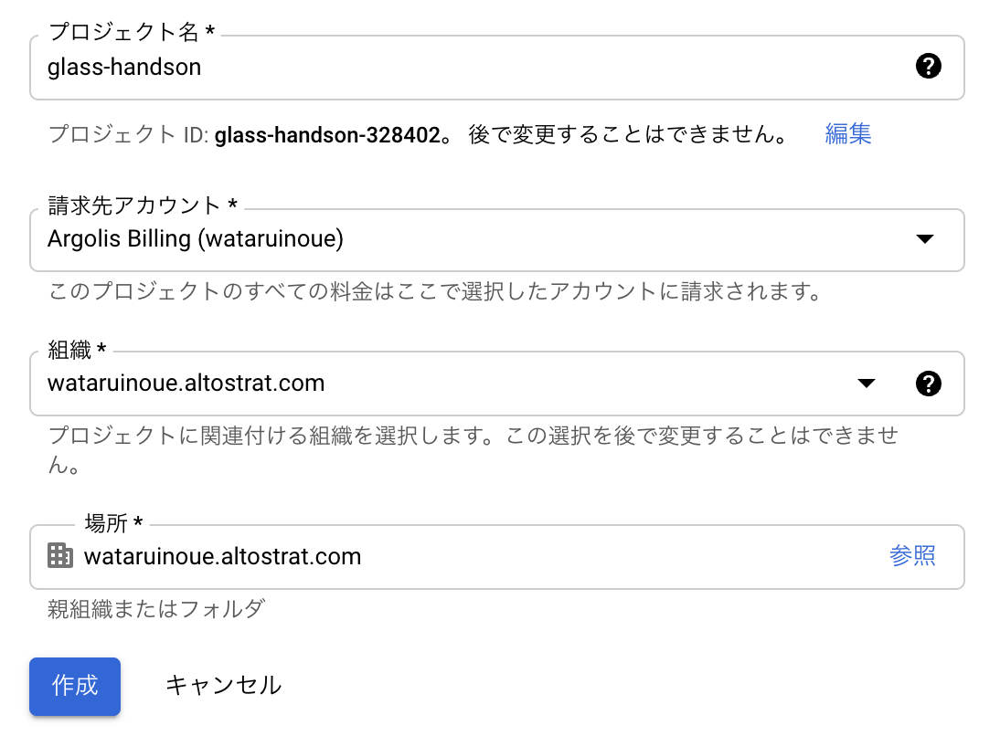
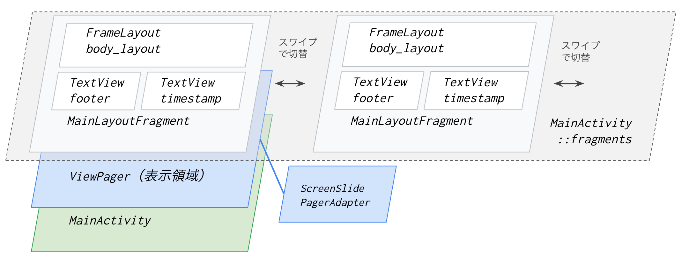
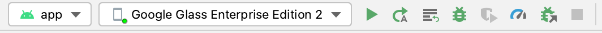
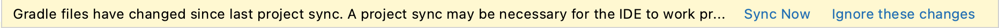
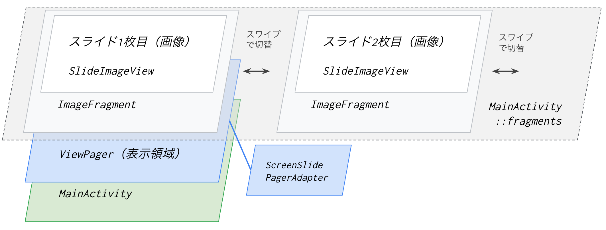
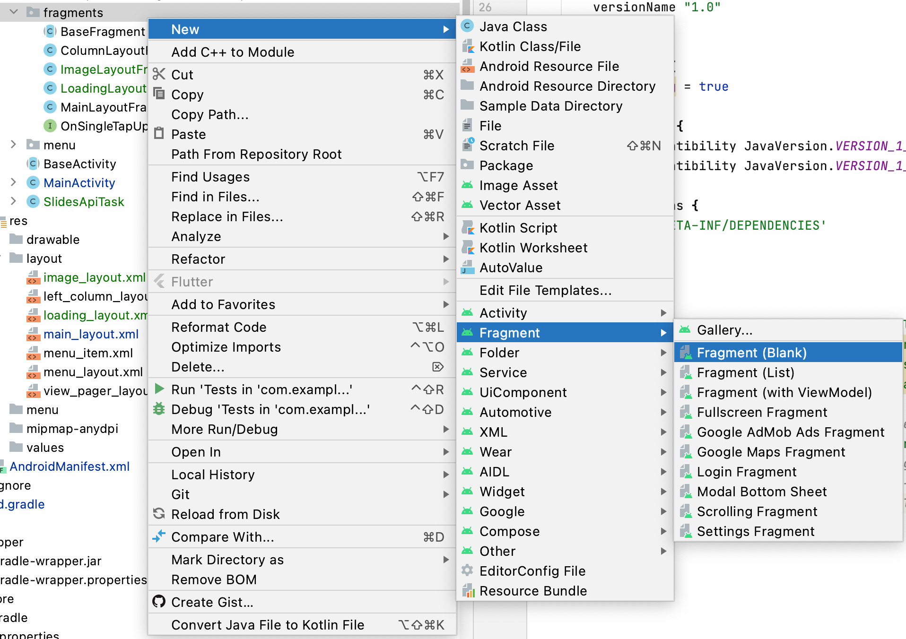

id: glass_integration_with_gws
status: [published]
author: Wataru Inoue
summary: Google Workspace と連携したアプリの開発
categories: Android, Glass
tags: android, googleglass, gws, workspace
feedback link: https://github.com/nosu/glass-handson-integration-with-gws/issues

Google Workspace と連携したアプリの開発
==================================

コースの概要
----------

### はじめに

このコースでは、Google Glass Enterprise Edition 2 向けに、Google Workspace (以下 `GWS`) と連携するアプリケーションの開発を行います。
Glass 用のアプリケーションは、オフラインで完結するものを開発することも可能ですが、GWS に含まれる Google Drive / Google Calendar / Google Slides 等の様々なクラウドサービスと連携することで、より便利な機能を実現することができます。

今回は、Google Slides と連携して、PC 等で作成したスライド（プレゼンテーション）を、Glass の画面に表示し、スワイプ操作でページめくりを行うことができるアプリケーションを開発してみます。


### 必要なもの
- Google Glass Enterprise Edition 2 （あれば）
- 以下がインストールされた PC
  - Android Studio
  - git
  - Android Emulator（Google Glass Enterprise Edition 2 がない場合）
- Google Cloud アカウント
- Google Workspace アカウント


### 必要な事前知識

このコースでは、以下の事前知識を前提としています。
- Android Studio の基本操作
- Google Glass Enterprise Edition 2 (またはエミュレータ)の操作方法
- Android アプリケーション開発の基礎
- Java の基本的な文法


### このコースで学ぶこと

- Google API Client ライブラリによる Google API の利用
- Fragment や Layout の作成方法
- Android における非同期処理の実装方法

### このコースでやること

`CardSample` プロジェクトをベースに、Google Slides と連携して、PC 等で作成したスライド（プレゼンテーション）を、Glass の画面に表示し、スワイプ操作でページめくりを行うことができるアプリケーションを開発してみます。

前半では、Slides API をはじめとするクラウド側の準備作業を行います。
後半では、 `CardSample` をベースとして、スライドを表示するための実装を行います。


Google Cloud / GWS 側の準備
--------------------------

まずは、アプリから Slides API を呼び出すことができるように、クラウドサービス側の準備を行います。

- Google Cloud プロジェクトの作成・選択
- Slides API の有効化
- サービスアカウントの作成と権限の付与
- サービスアカウントの鍵を作成・ダウンロード
- テスト用スライドの準備

### Google Cloud プロジェクトの作成・選択

今日のハンズオン用に Google Cloud のプロジェクトを作成します。

- Cloud Console ([https://console.cloud.google.com](https://console.cloud.google.com)) にアクセスする
- ヘッダにあるプロジェクト名（ここでは `glass-handson`）をクリックし、表示されたダイアログから「新しいプロジェクト」を選択

<!--  -->
- 適当なプロジェクト名を入力し、「作成」をクリック

- 作成完了の通知が表示されたら、通知ポップアップから作成したプロジェクトに切り替える

> aside positive
> プロジェクトを作成せず、作成済みのプロジェクトをそのまま利用いただいても構いません。その場合は、ヘッダにあるプロジェクト名をクリックしてから、使用したいプロジェクトを選択してください。

### Slides API の有効化

Google Cloud では、意図しない API の利用を防ぐために、デフォルトではすべての API が無効化されています。
今回開発するアプリでは Slides API を利用したいので、Slides API を明示的に有効化します。

- Console 画面上部にある検索窓に、”slides api” などと入力し、表示された候補から「Google Slides API」を選択する
- 「有効にする」をクリックしてしばらく待つ

### サービスアカウントの作成と権限の付与

- Console の左メニューから「IAM と管理」→「サービスアカウント」をクリック
- 「＋ サービスアカウントを作成」をクリック
- 以下のとおり入力して、`完了` をクリック（あるいは違う名前でも構いません）
  - サービスアカウント名: `glass-slides-app`
  - サービスアカウントID: `glass-slides-app`
- サービスアカウント一覧画面に戻ったら、今作成したサービスアカウントのメールアドレス（`glass-slides-app@<ProjectID>.iam.gserviceaccount.com`）をコピーしてメモしておく


### サービスアカウントの鍵を作成・ダウンロード

次に、作成したサービスアカウントで認証を行うためのキーファイルをダウンロードします。

- サービスアカウント一覧画面で、先ほど作成した `glass-slides-app@<ProjectID>.iam.gserviceaccount.com` の列の右側にある `操作` という列の `…` アイコンをクリック
- `鍵を管理` をクリック
- `鍵を追加` をクリックし、`新しい鍵を作成` をクリック
- `キーのタイプ` として `JSON` が選択されていることを確認し、`作成` をクリック
- 鍵が作成されて、自動的に鍵の JSON ファイルがダウンロードされる


### テスト用スライドの準備

アプリから表示してみるためのテスト用スライドを用意します。

- [Google Slides](https://docs.google.com/presentation/u/0/?tgif=d) にアクセスし、新規スライドを作成する
> aside positive
> ブラウザから [slides.new](https://slides.new/) にアクセスすることでも新しいスライドを作成できます
- 作成したスライドに新しいページを何枚か追加し、適当な内容を記載する
- スライド編集画面の URL に含まれる `Presentation ID` をメモしておく
  - スライドの URL は `https://docs.google.com/presentation/d/{Presentation ID}/edit` となっています


### サービスアカウントにテスト用スライドへの閲覧権限を付与

- 画面右上の `Share`（`共有`）ボタンをクリック
- 入力欄に、先ほど作成したサービスアカウントのメールアドレス（`glass-slides-app@<ProjectID>.iam.gserviceaccount.com`）を入力して、`Viewer`（`閲覧者`）を選択してから `Send`（`送信`）をクリックする

以上でクラウド側の準備は完了です。


アプリ実装(1) Android Project の準備
---------------------------------

クラウドサービスの準備ができたので、いよいよアプリ側の実装を進めていきます。

### ベースとなるプロジェクトの準備

今回は、公式の Glass 用サンプルアプリ集にある `CardSample` というアプリをベースに実装を行います。
リポジトリをクローンし、Android Studio で開いてみましょう。

- 以下のコマンドで Git リポジトリをローカルに Clone する
```bash
git clone https://github.com/googlesamples/glass-enterprise-samples.git
```
- Android Studio で File -> Open をクリックし、 `glass-enterprise-samples/CardSample` を選択して開く

### CardSample アプリの構成確認

`CardSample` アプリでは、`MainActivity` 上に `ViewPager` というスワイプで表示を切り替えるための要素を配置し、そこに `MainLayoutFragment` という画面パーツを4つ配置しています。



実際にアプリケーションをビルドして、動作を試してみましょう。

- Android Studio のツールバーで、デプロイ先に `Google Glass Enterprise Edition 2`（実機がない場合は Google Glass Enterprise Edition 2 用エミュレータ）を選択して、▶ ボタンをクリック
- アプリがビルドされ、実機またはエミュレータで実行されるので、左右にスワイプして、画面が切り替わることを確認



> aside negative
> ビルド時に `SDK location not found.` と表示された場合、`CardSample` 内の `local.properties` というファイルを `GestureLibrarySample` 内にコピーすることで解消する場合があります。


アプリ実装(2) ライブラリや設定の追加
---------------------------

次に、`CardSample` Project に対して、必要なライブラリや設定を追加していきます。

### Google API Client ライブラリの追加

Android Studio のビルドツールである Gradle の設定ファイル（build.gradle）に、以下のライブラリを追加します。

| ライブラリ名 | 用途 |
|---|---|
| `google-api-services-slides` | Slides API 用 Client ライブラリ |
| `google-auth-library-oauth2-http` | Client ライブラリで使用する認証用ライブラリ |
| `glide` | 画像を簡単に扱うためのライブラリ |


- `CardSample/app/build.gradle` をダブルクリックで開き、以下の2行を追記する
```gradle
dependencies {
    ...
    implementation 'com.google.apis:google-api-services-slides:v1-rev20210820-1.32.1'
    implementation 'com.google.auth:google-auth-library-oauth2-http:1.2.0'
    implementation 'com.github.bumptech.glide:glide:4.12.0'
    annotationProcessor 'com.github.bumptech.glide:compiler:4.12.0'
}
```

- Android Studio の右ペイン上部に以下のような警告が出てくるので、”Sync Now” をクリックして、Android Studio 全体に変更を反映する



> aside positive
> #### Google API Client ライブラリとは
> Google API は REST API として提供されているため、当然生の HTTP Request を送って操作することも可能です。しかしその場合、受け取るレスポンスの型定義をはじめ、実装に少し手間がかかります。
> Google API Client ライブラリを使うことで、そのような手間なく簡単に API を利用できます。
> Google API Client ライブラリは、Java だけではなく Python, .NET, JavaScript, Go, PHP 等、様々な言語向けに提供されています。
> 
> （参考）[API Client Libraries | Google Developers](https://developers.google.com/api-client-library?hl=ja)


> aside positive
> #### Glide について
> Android アプリで Bitmap 画像を扱う場合、自力で適切にメモリ管理を行うのは大変です。Glide というライブラリを使用することで、実装を大幅に簡素化することができます。
> 
> （参考）[ビットマップ メモリの管理](https://developer.android.com/topic/performance/graphics/manage-memory?hl=ja)


### インターネット接続の Permission 追加

Android からインターネットに接続する場合、マニフェストの中で宣言する必要があります。元の `CardSample` アプリはインターネット接続を必要としないアプリでしたが、Slides API に接続するためには Permission を追加する必要があります。

- `CardSample/app/src/main/AndroidManifest.xml` を開き、以下の1行を追記する
```XML
<manifest xmlns:android="http://schemas.android.com/apk/res/android"
    package="com.example.android.glass.cardsample">

  <!-- 以下の1行を追加 -->
  <uses-permission android:name="android.permission.INTERNET"/>

  <application
      android:allowBackup="true"
      android:icon="@mipmap/ic_launcher"
      android:label="@string/app_name"
      android:roundIcon="@mipmap/ic_launcher"
      android:supportsRtl="true"
      android:theme="@style/AppTheme">
    ...
  </application>

</manifest>
```


アプリ実装(3) Fragment の実装
---------------------------

続いて、スライドを表示するためのビューとなる `Fragment` と、そのレイアウト定義を作成していきます。

図で説明すると、もともとの `CardSample` は以下のような画面構成になっていました。
`MainActivity` 上の `ViewPager` で `MainLayoutFragment` という文字列を表示する Fragment を表示していました。


これに手を加え、新たに `ImageFragment` という、スライドを表示するための `Fragment` を作成して差し替えることにします。差し替え後のイメージは以下のとおりです。




### スライド画像表示用の Fragment の作成

スライドの各ページを全画面で表示するための Fragment を作成します。

- 左ペインの Project Tree から、`CardSample/app/src/main/java/com.example.android.glass.cardsample/fragments` を右クリックし、`New` → `Fragment` → `Fragment (Blank)` をクリックする

- 以下のとおり入力して `Finish` をクリック

| 入力項目 | 入力値 |
|---|---|
| Fragment Name | `ImageLayoutFragment` |
| Fragment Layout Name | `image_layout` |
| Source Language | `Java` |

- `Add Files to Git` というダイアログが表示された場合、そのまま `Add` をクリックして、作成したファイルを Git 管理下に追加する


#### Fragment の画面 Layout の編集

Fragment のレイアウトに ImageView を配置します。

- 先ほどの `ImageLayoutFragment` 作成に伴って作成された `CardSample/app/src/main/res/layout/image_layout.xml` をダブルクリックして開く
- 右ペイン上部のメニューから `Design` から `Code` に切り替える
- XML から `TextView` のタグを削除し、代わりに以下のような `ImageView` を追加する
```XML
<FrameLayout ...>
    ...

    <!-- TextView は削除 -->
    <!-- <TextView
        android:layout_width="match_parent"
        android:layout_height="match_parent"
        android:text="@string/hello_blank_fragment" /> -->

    <!-- ImageView を追加 -->
    <ImageView
        android:id="@+id/slideImageView"
        android:layout_width="640dp"
        android:layout_height="360dp" />
</FrameLayout>
```


### ImageLayoutFragment クラスの実装

`ImageLayoutFragment` クラスを編集し、インスタンスを生成する際に画像の URL を受け取って、先ほどのレイアウトに配置した `ImageView` にその URL からダウンロードした画像が表示されるようにします。

`Fragment` は、アプリの実行状態によっていつ破棄されて、いつ再生成されるかわからないので、再生成に必要な値は `Bundle` として保存しておき、それをもとに `onCreateView` メソッドで（再）生成処理が行えるようにする必要があります。

今回の `ImageLayoutFragment` の場合、実装は以下のようなイメージになります。

```Java
public class ImageLayoutFragment extends BaseFragment {
  public static ImageLayoutFragment newInstance(String imageUrl) {
    // 受け取った引数を Bundle に詰め込む処理等
  }

  @Nullable
  @Override
  public View onCreateView(@NonNull LayoutInflater inflater, @Nullable ViewGroup container, @Nullable Bundle savedInstanceState) {
    // Bundle の値を元に、Fragment を生成する処理
    // （今回の場合：URL から画像を取得し、slideImageView にセットする処理）
  }
}
```

それでは実際に実装を進めます。

- `CardSample/app/src/main/java/com.example.android.glass.cardsample/fragments/ImageLayoutFragment` をダブルクリックして開く
- 以下のように、受け取った画像の URL（`thumbnailUrl`）を `Bundle` に保存する処理と、その URL をもとに画像をダウンロードして `ImageView` にセットする処理を記述する
```Java
package com.example.android.glass.cardsample.fragments;

import android.os.Bundle;
import android.view.LayoutInflater;
import android.view.View;
import android.view.ViewGroup;
import android.widget.ImageView;
import androidx.annotation.NonNull;
import androidx.annotation.Nullable;
import com.bumptech.glide.Glide;
import com.example.android.glass.cardsample.R;


public class ImageLayoutFragment extends BaseFragment {
  public static ImageLayoutFragment newInstance(String imageUrl) {
    final ImageLayoutFragment fragment = new ImageLayoutFragment();

    final Bundle args = new Bundle();
    args.putString("imageUrl", imageUrl);
    fragment.setArguments(args);

    return fragment;
  }

  @Nullable
  @Override
  public View onCreateView(@NonNull LayoutInflater inflater, @Nullable ViewGroup container, @Nullable Bundle savedInstanceState) {
    final View view = inflater.inflate(R.layout.image_layout, container, false);
    ImageView imageView = view.findViewById(R.id.slideImageView);
    String imageUrl = getArguments().getString("imageUrl");

    Glide.with(this)
        .load(imageUrl)
        .into(imageView);

    return view;
  }
}
```

> aside positive
> #### Glide を使用した画像のダウンロード
> Glide を使用すると、URL から画像をダウンロードする非同期処理を、非常にシンプルな記述で実装することができます。
> ここでは、`imageUrl` からダウンロードした画像を、`imageView` にセットする処理を行っています。


アプリ実装(4) サービスアカウントによる認証処理の実装
------------------------------------------

続いて、`Slides API` へのアクセスを行うための準備として、サービスアカウントによる認証処理を実装します。
具体的には、サービスアカウントの JSON 形式のキーファイルをソースコードに追加し、アプリケーション内で読み込んで認証クレデンシャルとして使用できるようにします。

### キーファイルを Asset としてソースコードに追加

まずは、キーの JSON ファイルを Assets としてソースコードに追加します。

- Android Studio 左ペインの Project ツリーから、`CardSample/app/src/main` を右クリックし、`New` → `Folder` → `Assets` をクリックする
- 表示されたダイアログで `Finish` をクリックすると、`main` 配下に `Assets` フォルダが作成される
- Cloud Console からダウンロードしたサービスアカウントのキーファイルを、作成した `Assets` フォルダにドラッグアンドドロップする
- `Move` というダイアログが表示されたら、入力内容はそのままで `Refactor` ボタンをクリックする
- `Add Files to Git` というダイアログが表示された場合、`Cancel` をクリックして、Git 管理化にファイルを追加しないようにする

### キーファイルを読み込む処理の実装

認証クレデンシャルは、のちのち `MainActivity` から Slides API を呼び出す際に使用するため、`MainActivity` 上にキーファイルを読み込む処理を実装していきます。

- `MainActivity` をダブルクリックして開く
- キーファイルを読み込んで `com.google.auth.oauth2.GoogleCredentials` として返す `loadServiceAccountCredential()` メソッドを以下のように実装する（キーファイルのファイル名は適宜書き換える）
```Java
...
import com.google.api.services.slides.v1.SlidesScopes;
import com.google.auth.oauth2.GoogleCredentials;
import android.content.res.AssetManager;
import java.io.IOException;
import java.io.InputStream;
import java.util.ArrayList;
import java.util.Collection;
...

public class MainActivity extends BaseActivity {
    private final String SERVICE_ACCOUNT_FILENAME = "{キーファイルのファイル名(e.g. foo.json)}";

    ...

    private GoogleCredentials loadServiceAccountCredential() throws IOException {
        Collection<String> scopes = new ArrayList<String>();
        scopes.add(SlidesScopes.PRESENTATIONS_READONLY);
        AssetManager assetManager = getAssets();
        InputStream inputStream = assetManager.open(SERVICE_ACCOUNT_FILENAME);
        GoogleCredentials credentials = GoogleCredentials.fromStream(inputStream);
        return credentials;
    }
}
```

> aside positive
> #### AssetManager について
> `android.content.res.AssetManager` を利用することで、Assets フォルダ内のファイルをソースコードから簡単に読み込むことができます

> aside positive
> #### Google API の Scope
> Google API の認証においては、利用したい API の種類を `Scope` として必ず指定する必要があります。今回はスライドの読み取りのみを行いたいので、Slides API Client に含まれる `SlidesScopes.PRESENTATIONS_READONLY` という定数を `Scope` に追加しています。この定数の実際の値は `https://www.googleapis.com/auth/presentations.readonly` というもので、もちろんこの文字列を直接 `Scope` として追加しても問題ありません。
> 
> 参考）[Google API の Scope 一覧](https://developers.google.com/identity/protocols/oauth2/scopes)


アプリ実装(5) API からデータを取得する非同期処理の実装
----------------------------------------------

Google API Client を使い、Slides API からデータを取得するための処理を記述していきます。
Android アプリでは、HTTP 通信等の時間のかかる処理は、メインスレッド（UI スレッド）ではなく、ワーカースレッドで非同期に実行する必要があります。
今回は、非同期処理を実装する方法として `AsyncTask` を継承したクラスを作成していきます。


> aside negative
> `AsyncTask` クラスは、Android 11（API Level 30）で `非推奨（Deprecated）` 扱いとなりました。今後は代わりの方法として、Kotlin Coroutine などを利用することが推奨されます。
> 
> ただし、本コースでは、Glass の OS が Android 8.1（API Level 27）であることを踏まえて `AsyncTask` を利用しています。


### AsyncTask とは

`AsyncTask` を継承するクラスのインスタンスを作成して `execute()` メソッドを実行すると、`doInBackground()` メソッドに記述した処理が開始されます。
その後、非同期処理が完了すると、`onPostExecute()` に記述した処理が実行されます。

今回の場合、`doInBackground()` において、`Slides API` からスライドの各ページの画像をダウンロードするための URL を取得する処理を行います。

`Slides API` にアクセスする `SlidesApiTask` クラスは以下のようなコードになります。

```Java
public class SlidesApiTask extends AsyncTask<Void, Void, List<Bitmap>> {
    @Override
    protected List<Bitmap> doInBackground(Void... args) {
        // スライドの各ページを取得する処理
    }

    @Override
    protected void onPostExecute(List<Bitmap> result) {
        // API からのページ取得完了後にやりたい処理
    }
}
```

`MainActivity` からこの `SlidesApiTask` を実行し、取得した画像 URL を `ImageLayoutFragment#newInstance` に渡すことで、最終的に URL の画像を表示する Fragment を生成することができます。 


### SlidesApiTask クラスの作成

それでは実際に `SlidesApiTask` クラスを実装していきます。

- Android Studio の Project Tree で `CardSample/app/src/main/java/com.example.android.glass.cardsample` を右クリックし、New -> Java Class をクリックする
- 入力欄に `SlidesApiTask` と入力し、Enter を押下する
- `Add Files to Git` というダイアログが表示された場合、そのまま `Add` をクリックして、作成したファイルを Git 管理下に追加する


今回、API からのページ取得完了後には、取得したページの画像を配置した Fragment を生成して`MainActivity` のメンバ変数に格納するなど、`MainActivity` に関連した処理を行う必要があります。
これを実現するために、`Listener` という interface を定義し、`SlidesApiTask` のコンストラクタで `Listener` を渡し、処理完了後の `onPostExecute()` において `Listener#onSuccess` を呼び出すようにします。

`SlidesApiTask` クラスの全体像は以下のような感じになります。

```Java
public class SlidesApiTask extends AsyncTask<Void, Void, List<String>> {
    private Listener listener;

    public SlidesApiTask(Listener listeners) {
        this.listener = listener;
    }

    @Override
    protected List<String> doInBackground(Void... args) {
        // スライドの各ページを取得する処理
    }

    @Override
    protected void onPostExecute(List<String> result) {
        if (listener != null) {
            listener.onSuccess(result);
        }
    }

    interface Listener {
        void onSuccess(List<String> result);
    }
}
```

この `SlideApiTask` を `MainActivity` から呼び出す場合には、以下のように、完了時に行いたい処理を記述した `Listener` を作成し、`SlideApiTask` のコンストラクタに渡します。

```Java
public class MainActivity extends BaseActivity {
    ...

    @Override
    protected void onCreate(Bundle savedInstanceState) {
        super.onCreate(savedInstanceState);

        try {
            SlidesApiTask.Listener listener = createSlidesApiTaskListener();
            slidesApiTask = new SlidesApiTask(listener);
            slidesApiTask.execute();
        } catch (GeneralSecurityException e) {
            e.printStackTrace();
        } catch (IOException e) {
            e.printStackTrace();
        }
    }

    ...

    private SlidesApiTask.Listener createSlidesApiTaskListener() throws GeneralSecurityException, IOException {
        return new SlidesApiTask.Listener() {
            @Override
            public void onSuccess(List<Bitmap> thumbnails) {
                // MainActivity 側でやりたいこと
                // （あとで実装します）
            }
        };
    }
```


### Slides API Client ライブラリの使い方

Slides API Client ライブラリを使うと、Slides API をシンプルに利用することができます。

[Slides API のリファレンス](https://developers.google.com/slides/api/reference/rest)

使い方としては、まず `Slides#Builder` に認証情報等を渡して `Slides` オブジェクトを作成してから、その `Slides` オブジェクトのメソッドをたどって処理を実行していきます。

```Java
Slides slides = new Slides.Builder(HTTP_TRANSPORT, JSON_FACTORY, requestInitializer)
                    .setApplicationName("glass-handson")
                    .build();
```

今回の場合、スライドの各ページの画像を取得したいので、まずは `PresentationId` を指定してスライドの全体枚数や各ページの `ObjectId` を把握してから、`getThumbnail` というメソッドで各ページのサムネイル画像の URL を取得していきます。

> aside positive
> `PresentationId` は、前の手順で Slide を作成したときにメモしたものを指定してください。
> スライドの URL：`https://docs.google.com/presentation/d/{Presentation ID}/edit`


```Java
Slides slides = new Slides.Builder(HTTP_TRANSPORT, JSON_FACTORY, requestInitializer)
                    .setApplicationName("glass-handson")
                    .build();

String presentationId = "<PresentationId>";
Presentation presentation = slides.presentations().get(presentationId).execute();
List<Page> pages = presentation.getSlides();
for(int i = 0; i < pages.size(); ++i){
    Page page = pages.get(i);
    Thumbnail thumbnail = slides.presentations()
                        .pages()
                        .getThumbnail(presentationId, page.getObjectId())
                        .setThumbnailPropertiesThumbnailSize("MEDIUM")
                        .execute();
    thumbnailUrls.add(thumbnail.getContentUrl());
}
```

> aside positive
> #### Slides API から取得するサムネイルのサイズ
> Slides API から取得するサムネイル画像はサイズを指定することができるようになっています。ここでは、`MEDIUM` を指定して横幅 800px のサムネイルを取得しています。
> 
> （参考）[`presentations.pages.getThumbnail` メソッドの詳細](https://developers.google.com/slides/api/reference/rest/v1/presentations.pages/getThumbnail)


### SlidesApiTask の実装

ここまでの内容を踏まえ、`SlidesApiTask` の最終的な実装は以下のようになります。

```Java
package com.example.android.glass.cardsample;

import android.os.AsyncTask;
import android.util.Log;

import com.google.api.services.slides.v1.Slides;
import com.google.api.services.slides.v1.model.*;
import com.google.api.client.googleapis.javanet.GoogleNetHttpTransport;
import com.google.api.client.http.HttpRequestInitializer;
import com.google.api.client.json.JsonFactory;
import com.google.api.client.json.gson.GsonFactory;
import com.google.api.client.http.HttpTransport;
import com.google.api.services.slides.v1.model.Presentation;
import com.google.auth.http.HttpCredentialsAdapter;
import com.google.auth.oauth2.GoogleCredentials;

import java.io.IOException;
import java.security.GeneralSecurityException;
import java.util.ArrayList;
import java.util.List;

public class SlidesApiTask extends AsyncTask<Void, Void, List<String>> {
    private Listener listener;
    private GoogleCredentials credentials;
    private String presentationId;
    private final HttpTransport HTTP_TRANSPORT = GoogleNetHttpTransport.newTrustedTransport();
    private final JsonFactory JSON_FACTORY = GsonFactory.getDefaultInstance();

    public SlidesApiTask(Listener listener, String presentationId, GoogleCredentials credentials) throws GeneralSecurityException, IOException {
        this.listener = listener;
        this.presentationId = presentationId;
        this.credentials = credentials;
    }

    @Override
    protected List<String> doInBackground(Void... args) {
        List<String> thumbnailUrls = new ArrayList<String>();

        try {
            HttpRequestInitializer requestInitializer = new HttpCredentialsAdapter(credentials);
            Slides slides = new Slides.Builder(HTTP_TRANSPORT, JSON_FACTORY, requestInitializer)
                    .setApplicationName("glass-handson")
                    .build();
            Presentation presentation = slides.presentations().get(presentationId).execute();
            List<Page> pages = presentation.getSlides();
            for(int i = 0; i < pages.size(); ++i){
                Page page = pages.get(i);
                Thumbnail thumbnail = slides.presentations()
                        .pages()
                        .getThumbnail(presentationId, page.getObjectId())
                        .setThumbnailPropertiesThumbnailSize("MEDIUM")
                        .execute();
                thumbnailUrls.add(thumbnail.getContentUrl());
            }

            Log.d("SlidesApiTask", "got thumbnailUrls successfully");
            Log.d("SlidesApiTask", thumbnailUrls.toString());
        } catch (IOException e) {
            e.printStackTrace();
        }

        return thumbnailUrls;
    }

    @Override
    protected void onPostExecute(List<String> result) {
        if (listener != null) {
            listener.onSuccess(result);
        }
    }

    interface Listener {
        void onSuccess(List<String> result);
    }
}
```


## アプリ実装(6) MainActivity の残りの実装

ここまでの作業で、Slides API からスライド画像を取得する処理や、スライド画像を表示するためのビューの実装は完了しました。

あとは、`MainActivity` にそれらを利用するためのコードを追加していきます。


### 不要な記述の削除

まずは、`MainActivity#onCreate` で行っている画面のセットアップ処理を一旦まるごと削除します。

```Java
public class MainActivity extends BaseActivity {
    ...
    @Override
    protected void onCreate(Bundle savedInstanceState) {
        super.onCreate(savedInstanceState);
        setContentView(R.layout.view_pager_layout);

        // ここから下を削除
        final ScreenSlidePagerAdapter screenSlidePagerAdapter = new ScreenSlidePagerAdapter(
            getSupportFragmentManager());
        viewPager = findViewById(R.id.viewPager);
        viewPager.setAdapter(screenSlidePagerAdapter);

        fragments.add(MainLayoutFragment
            .newInstance(getString(R.string.text_sample), getString(R.string.footnote_sample),
                getString(R.string.timestamp_sample), null));
        fragments.add(MainLayoutFragment
            .newInstance(getString(R.string.different_options), getString(R.string.empty_string),
                getString(R.string.empty_string), R.menu.main_menu));
        fragments.add(ColumnLayoutFragment
            .newInstance(R.drawable.ic_style, getString(R.string.columns_sample),
                getString(R.string.footnote_sample), getString(R.string.timestamp_sample)));
        fragments.add(MainLayoutFragment
            .newInstance(getString(R.string.like_this_sample), getString(R.string.empty_string),
                getString(R.string.empty_string), null));

        screenSlidePagerAdapter.notifyDataSetChanged();

        final TabLayout tabLayout = findViewById(R.id.page_indicator);
        tabLayout.setupWithViewPager(viewPager, true);
        // ここから上を削除
    }
    ...
}
```

### `SlideApiTask` 完了時に呼び出してもらう `Listener` の実装

次に、`SlideApiTask` で画像 URL 取得が完了した際に呼び出してもらう `Listener` を作成するメソッドを `createSlidesApiTaskListener` として実装していきます。
`createSlidesApiTaskListener` の `onSuccess` の中では、先ほど `onCreate` から削除したコードと似たような流れで、`fragments` 変数に、取得したページ画像を載せた `ImageLayoutFragment` を格納する処理を記述していきます。

- `MainActivity` をダブルクリックして開く
- import 文と、`createSlidesApiTaskListener` を以下のように実装する

```Java
// 以下の import 文も追記
import java.security.GeneralSecurityException;
import com.example.android.glass.cardsample.fragments.ImageLayoutFragment;

...

public class MainActivity extends BaseActivity {
    private final String SERVICE_ACCOUNT_FILENAME = "xxxx.json";

    private List<BaseFragment> fragments = new ArrayList<>();

    ...

    private SlidesApiTask.Listener createSlidesApiTaskListener() throws GeneralSecurityException, IOException {
        return new SlidesApiTask.Listener() {
            @Override
            public void onSuccess(List<String> thumbnailUrls) {
                final ScreenSlidePagerAdapter screenSlidePagerAdapter = new ScreenSlidePagerAdapter(
                        getSupportFragmentManager());
                viewPager = findViewById(R.id.viewPager);
                viewPager.setAdapter(screenSlidePagerAdapter);

                for(int i = 0; i < thumbnailUrls.size(); i++) {
                    fragments.add(ImageLayoutFragment
                            .newInstance(thumbnailUrls.get(i)));
                }

                screenSlidePagerAdapter.notifyDataSetChanged();

                final TabLayout tabLayout = findViewById(R.id.page_indicator);
                tabLayout.setupWithViewPager(viewPager, true);
            }
        };
    }

}
```


### Activity 生成時に `SlidesApiTask` を実行開始する

`MainActivity` 生成時に呼ばれる `onCreate` の中で、作成した `SlidesApiTask` を実行開始します。
`SlidesApiTask` には、先ほど実装した `createSlidesApiTaskListener` で作成した `listener` を渡しておきます。

```Java
public class MainActivity extends BaseActivity {
    ...
    private SlidesApiTask slidesApiTask;
    private final String PRESENTATION_ID = "xxx";

    @Override
    protected void onCreate(Bundle savedInstanceState) {
        super.onCreate(savedInstanceState);

        setContentView(R.layout.view_pager_layout);

        try {
            GoogleCredentials credentials = loadServiceAccountCredential();
            SlidesApiTask.Listener listener = createSlidesApiTaskListener();
            slidesApiTask = new SlidesApiTask(listener, PRESENTATION_ID, credentials);
            slidesApiTask.execute();
        } catch (GeneralSecurityException e) {
            e.printStackTrace();
        } catch (IOException e) {
            e.printStackTrace();
        }

    }

    ...
}
```

以上で `MainActivity` の実装は完了です。
最終形の `MainActivity` は以下のようになります。

```Java
package com.example.android.glass.cardsample;

import android.content.res.AssetManager;
import android.os.Bundle;
import androidx.fragment.app.Fragment;
import androidx.fragment.app.FragmentManager;
import androidx.fragment.app.FragmentStatePagerAdapter;
import androidx.viewpager.widget.ViewPager;
import com.example.android.glass.cardsample.fragments.BaseFragment;
import com.example.android.glass.cardsample.fragments.ImageLayoutFragment;
import com.example.glass.ui.GlassGestureDetector.Gesture;
import com.google.android.material.tabs.TabLayout;
import com.google.api.services.slides.v1.SlidesScopes;
import com.google.auth.oauth2.GoogleCredentials;

import java.io.IOException;
import java.io.InputStream;
import java.security.GeneralSecurityException;
import java.util.ArrayList;
import java.util.Collection;
import java.util.List;

public class MainActivity extends BaseActivity {
    private List<BaseFragment> fragments = new ArrayList<>();
    private ViewPager viewPager;
    private SlidesApiTask slidesApiTask;

    private final String PRESENTATION_ID = "xxxx";
    private final String SERVICE_ACCOUNT_FILENAME = "xxxx.json";

    @Override
    protected void onCreate(Bundle savedInstanceState) {
        super.onCreate(savedInstanceState);

        setContentView(R.layout.view_pager_layout);

        try {
            GoogleCredentials credentials = loadServiceAccountCredential();
            SlidesApiTask.Listener listener = createSlidesApiTaskListener();
            slidesApiTask = new SlidesApiTask(listener, PRESENTATION_ID, credentials);
            slidesApiTask.execute();
        } catch (GeneralSecurityException e) {
            e.printStackTrace();
        } catch (IOException e) {
            e.printStackTrace();
        }

    }

    @Override
    public boolean onGesture(Gesture gesture) {
        switch (gesture) {
            case TAP:
                fragments.get(viewPager.getCurrentItem()).onSingleTapUp();
                return true;
            default:
                return super.onGesture(gesture);
        }
    }

    private class ScreenSlidePagerAdapter extends FragmentStatePagerAdapter {

        ScreenSlidePagerAdapter(FragmentManager fm) {
            super(fm);
        }

        @Override
        public Fragment getItem(int position) {
            return fragments.get(position);
        }

        @Override
        public int getCount() {
            return fragments.size();
        }
    }


    private SlidesApiTask.Listener createSlidesApiTaskListener() throws GeneralSecurityException, IOException {
        return new SlidesApiTask.Listener() {
            @Override
            public void onSuccess(List<String> thumbnailUrls) {
                final ScreenSlidePagerAdapter screenSlidePagerAdapter = new ScreenSlidePagerAdapter(
                        getSupportFragmentManager());
                viewPager = findViewById(R.id.viewPager);
                viewPager.setAdapter(screenSlidePagerAdapter);

                for(int i = 0; i < thumbnailUrls.size(); i++) {
                    fragments.add(ImageLayoutFragment
                            .newInstance(thumbnailUrls.get(i)));
                }

                screenSlidePagerAdapter.notifyDataSetChanged();

                final TabLayout tabLayout = findViewById(R.id.page_indicator);
                tabLayout.setupWithViewPager(viewPager, true);
            }
        };
    }

    private GoogleCredentials loadServiceAccountCredential() throws IOException {
        Collection<String> scopes = new ArrayList<String>();
        scopes.add(SlidesScopes.PRESENTATIONS_READONLY);
        AssetManager assetManager = getAssets();
        InputStream inputStream = assetManager.open(SERVICE_ACCOUNT_FILENAME);
        GoogleCredentials credentials = GoogleCredentials.fromStream(inputStream);
        return credentials;
    }
}
```

- Android Studio の `▶` ボタンをクリックして実行してみる

> aside negative
> ビルド時に `More than one file was found with OS independent path 'META-INF/DEPENDENCIES'` というエラーが出た場合、`CardSample/app/build.gradle` を開き、以下を追記して Sync を行ってから再度ビルドしてください。

```gradle
android {
	…
    // 以下のセクションを追記
	packagingOptions {
		exclude 'META-INF/DEPENDENCIES'
	}
	…
}
```


おつかれさまでした！以上でこのコースは終了です！！